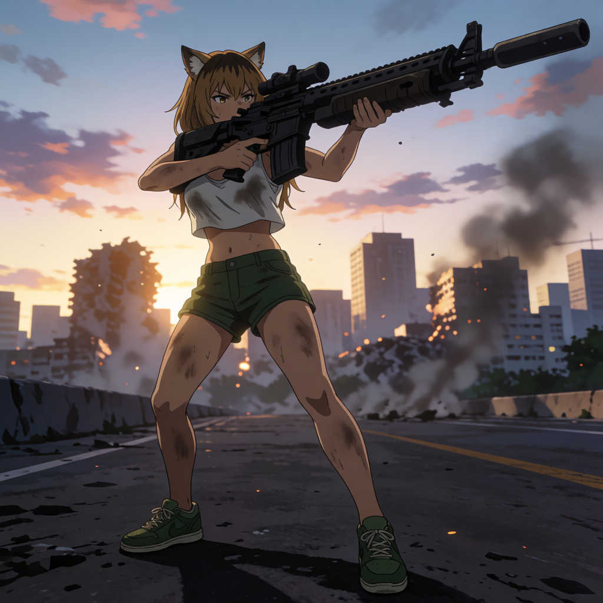
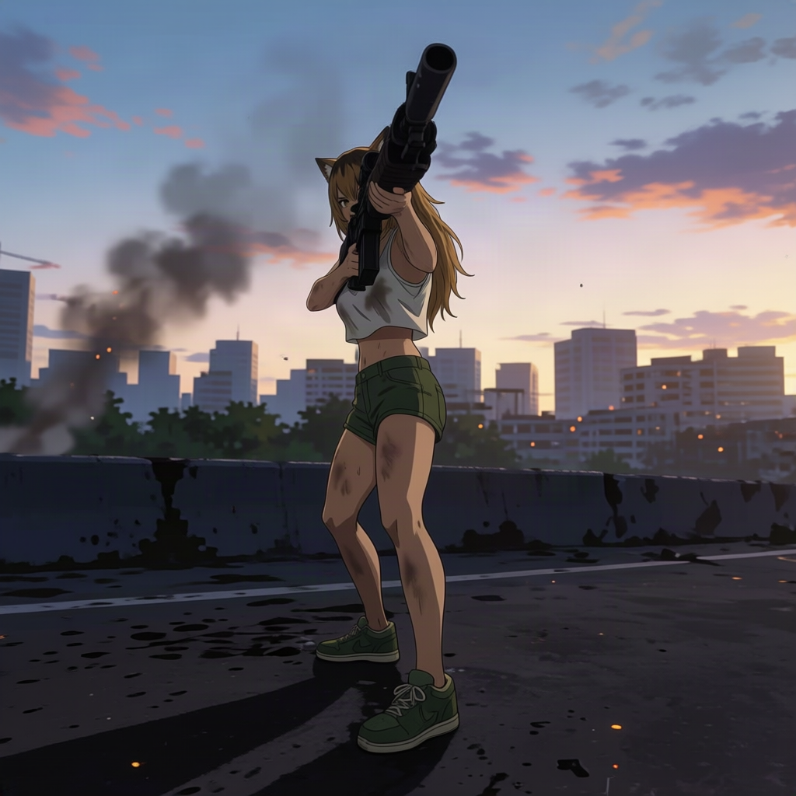
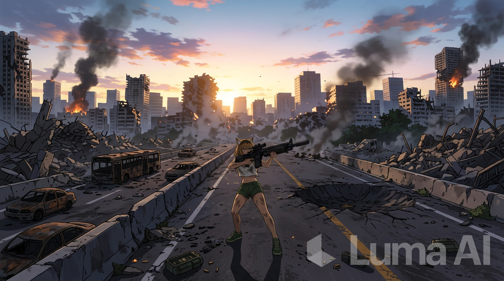
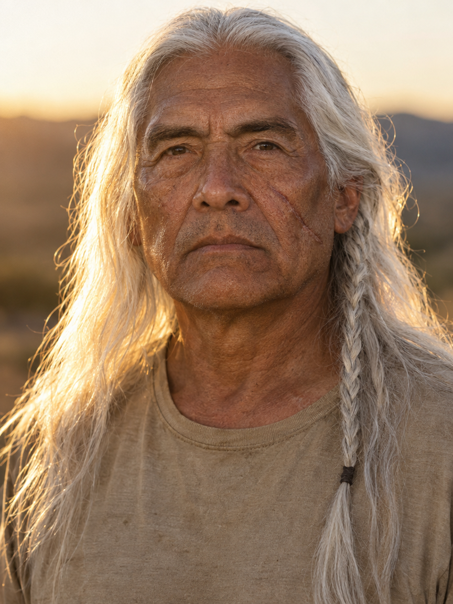

# Proyecto final

## Primer video

### Idea

Una chica-gato, disparando un rifle en una ciudad en ruinas, mientras la cámara se aleja. 

### Generación de imagen inicial

En [Krea](https://www.krea.ai/), mediante la herramienta **Image** (text-to-image):

> Full-body image of an adult brown-haired cat-girl, dressed in green shorts, a dirty white crop top, and green sneakers. She is standing on an avenue in a ruined city. She is firing a massive rifle with both hands. Realistic anime style, high quality, sunset lighting, somber colors.

### Generación de imagen rotada sobre un eje

En [Krea](https://www.krea.ai/), mediante la herramienta **Edit** > **Change Camera Angle**, y ajustando los ejes.

### Generación de imagen alejada

¡Me quedé sin créditos! Así que lo hice en [Luma](https://lumalabs.ai/), mediante la herramienta **Create Image**, modelo Nano Banana 2, usano la imagen 1 como refencia:

> Extend image, zooming out, and revealing more of the ruined city.

### Generación de video

En [Luma](https://lumalabs.ai/), mediante la herramienta **Create Video**, modelo Ray3.2, y 3 key frames: imagen 2, imagen 1, imagen 3.

> The camera rotates to the left. Then it moves away from the scene, showing more of the ruined city. The girls fires her machine gun continuously.

Hice algunos intentos, pero en todos los casos el alejamiento de cámara final no quedó muy bien. Este fue el video que más me gustó y se asemejaba más a lo que tenía pensado.

https://github.com/user-attachments/assets/2330b436-7976-4f78-b65d-321b75243488

## Segundo video

### Idea

Un hombre mayor hablando sobre una propuesta de contacto con la naturaleza.

### Generación de imagen inicial

En [Glif](https://glif.app/), mediante la herramienta **AI Image Generator** (text-to-image), motor GPT Image 2.5:

> The face of an older man with weathered, light-brown skin and an impassive expression. He has long white hair cascading over his shoulders and back, with a hair braid hanging over the right side of his head. His face bears a large scar across his left cheek. He wears a simple, worn sand-colored t-shirt. The scene shows the man from the head down to the chest. Golden hour lighting, photorealistic, high quality, real life.

### Generación de video

En [HeyGen](https://www.heygen.com/), creando un avatar a partir de la imagen anterior y la voz Cornelius. Guión:

> Aquí no tenemos Wifi, tomas USB o café macchiato. Lo que tenemos es contacto con la naturaleza. Por las mañanas,, trabajamos en el campo para fortalecer el cuerpo y despejar la mente. Por la tarde, caminamos por los montes, o montamos a caballo. Justo lo que recomendó el doctor.

https://github.com/user-attachments/assets/5799071f-d8e6-4984-a87f-90732a3e7426
